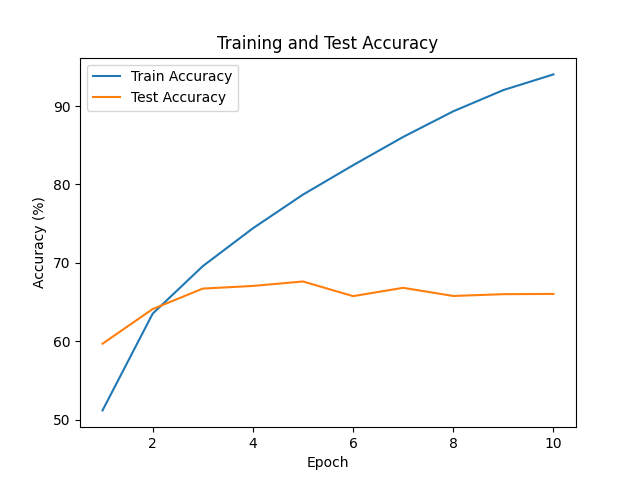
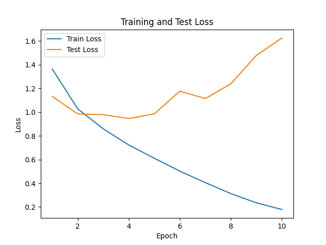

<div align="center">

# CIFAR-10 CNN

### An image classifier you can train, ship, and serve.

A convolutional neural network built with **PyTorch**, trained on the CIFAR-10 dataset
and served as a REST API with **FastAPI**.


**Classes:** `airplane` · `automobile` · `bird` · `cat` · `deer` · `dog` · `frog` · `horse` · `ship` · `truck`

<br/>



</div>

---

CIFAR-10 CNN is a small image-classification project for Assignment 2. You train a custom
convolutional network on the 10-class CIFAR-10 dataset, save the best checkpoint, and then
load that checkpoint into a FastAPI service that predicts the class of any uploaded image.

## Project Structure

```text
assignment2/
├── app/
│   └── main.py            # FastAPI inference server (GET /, POST /predict)
├── model_cnn/
│   ├── model.py           # CNN architecture
│   ├── data_loader.py     # CIFAR-10 train/test DataLoaders
│   ├── trainer.py         # Training loop (Adam + CrossEntropyLoss)
│   ├── evaluator.py       # Test-set evaluation
│   ├── checkpoints.py     # Save / load .pth checkpoints
│   ├── utils.py           # Device, transforms, plotting, CLASSES
│   └── test_model.py      # Quick forward-pass shape check
├── train.py               # Training entry point
├── data/                  # CIFAR-10 dataset (auto-downloaded)
├── models/                # Saved checkpoints (best_model.pth, final_model.pth)
├── results/               # Training summary + loss/accuracy plots
├── Dockerfile
└── README.md
```

## Model Architecture

The network expects `3 × 64 × 64` RGB tensors (images are resized to 64×64 and normalized
with the CIFAR-10 mean/std).

| Stage | Layer | Output |
|-------|-------|--------|
| Block 1 | `Conv2d(3, 16, 3, pad=1)` → ReLU → `MaxPool2d(2)` | 16 × 32 × 32 |
| Block 2 | `Conv2d(16, 32, 3, pad=1)` → ReLU → `MaxPool2d(2)` | 32 × 16 × 16 |
| Head | `Flatten` → `Linear(8192, 100)` → ReLU → `Linear(100, 10)` | 10 logits |

- **Optimizer:** Adam, `lr = 0.001`
- **Loss:** Cross-Entropy
- **Epochs:** 10, **batch size:** 64
- Softmax is applied at inference time (not inside the model).

## Requirements

This project uses **Python 3.12+** and is managed with [`uv`](https://docs.astral.sh/uv/).

Main dependencies:

- PyTorch (`torch`, `torchvision`)
- FastAPI + Uvicorn
- Pillow, NumPy, Matplotlib

> **Note:** `torch`, `torchvision`, and `pillow` are required by Assignment 2. If they are
> not yet declared in the root `pyproject.toml`, add them before syncing:
>
> ```bash
> uv add torch torchvision pillow numpy
> ```

## How to Run Locally

All commands below assume `assignment2/` is the working directory, since the code imports
the local `model_cnn` package.

### 1. Install dependencies

```bash
# from the repository root
uv sync
```

### 2. Train the model (optional — checkpoints already included)

```bash
cd assignment2
uv run python train.py
```

This downloads CIFAR-10 to `data/` (if missing) and writes:

- `models/best_model.pth` and `models/final_model.pth`
- `results/training_summary.json`
- `results/loss_curve.png`, `results/accuracy_curve.png`

### 3. Start the API

```bash
cd assignment2
uv run fastapi dev app/main.py
```

Then open the interactive Swagger UI:

```text
http://127.0.0.1:8000/docs
```

> The server loads `models/best_model.pth` at startup, so make sure that file exists.

## API Endpoints

### Root

```http
GET /
```

Example response:

```json
{
  "message": "Assignment 2 CIFAR10 CNN API is running",
  "model_path": ".../assignment2/models/best_model.pth"
}
```

### Predict

```http
POST /predict
```

Send an image as `multipart/form-data` with the field name `file`.

```bash
curl -X POST "http://127.0.0.1:8000/predict" \
  -F "file=@path/to/image.png"
```

Example response:

```json
{
  "predicted_class": "frog",
  "class_index": 6,
  "confidence": 0.8234
}
```

## How to Run with Docker

The build context is the **repository root** (so `pyproject.toml` and `uv.lock` are available),
while the Dockerfile lives in `assignment2/`.

### 1. Build the image

```bash
# from the repository root
docker build -f assignment2/Dockerfile -t assignment2-cnn .
```

### 2. Run the container

```bash
docker run -p 8000:80 assignment2-cnn
```

Then open:

```text
http://127.0.0.1:8000/docs
```

## Results

| Metric | Value |
|--------|-------|
| Total epochs | 10 |
| Best epoch | 4 |
| Best test accuracy | **67.08%** |
| Final test accuracy | 66.27% |
| Final train accuracy | 93.89% |

<div align="center">



</div>
