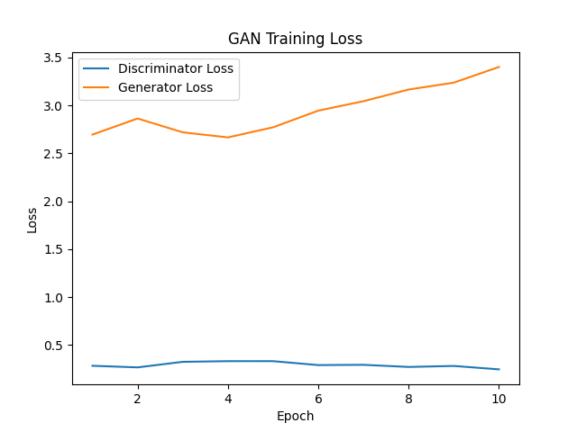

<div align="center">

# MNIST GAN

### A generative adversarial network you can train, ship, and serve.

A DCGAN-style generator and discriminator built with **PyTorch**, trained on the MNIST
dataset and served as a REST API with **FastAPI** that streams freshly generated digits.


<br/>



</div>

---

MNIST GAN is a small generative-modeling project for Assignment 3. You train a generator
and a discriminator in an adversarial loop on the 28×28 MNIST digits, save the generator
checkpoint, and then load that checkpoint into a FastAPI service that generates brand-new
handwritten-digit images on demand.

## Project Structure

```text
assignment3/
├── app/
│   └── main.py            # FastAPI inference server (GET /, /generate, /generate_batch)
├── model_combined/
│   ├── model.py           # Generator + Discriminator (and a CNN classifier)
│   ├── data_loader.py     # MNIST DataLoader for GAN training
│   ├── trainer.py         # Adversarial training loop (BCEWithLogits + Adam)
│   ├── evaluator.py       # Classifier evaluation helper
│   ├── checkpoints.py     # Save / load .pth checkpoints
│   └── utils.py           # Device, dirs, logging, plotting
├── train.py               # GAN training entry point
├── data/                  # MNIST dataset (auto-downloaded)
├── models/                # Saved checkpoints (generator.pth, best_generator.pth, ...)
├── results/               # Training log + loss curves
├── Dockerfile
└── README.md
```

## Model Architecture

The generator maps a `100`-dim noise vector to a `1 × 28 × 28` grayscale image, while the
discriminator scores a `1 × 28 × 28` image as real or fake.

### Generator

| Stage | Layer | Output |
|-------|-------|--------|
| Project | `Linear(100, 128·7·7)` → reshape | 128 × 7 × 7 |
| Up 1 | `ConvTranspose2d(128, 64, 4, s=2, p=1)` → BN → ReLU | 64 × 14 × 14 |
| Up 2 | `ConvTranspose2d(64, 1, 4, s=2, p=1)` → Tanh | 1 × 28 × 28 |

### Discriminator

| Stage | Layer | Output |
|-------|-------|--------|
| Down 1 | `Conv2d(1, 64, 4, s=2, p=1)` → LeakyReLU(0.2) | 64 × 14 × 14 |
| Down 2 | `Conv2d(64, 128, 4, s=2, p=1)` → BN → LeakyReLU(0.2) | 128 × 7 × 7 |
| Head | `Flatten` → `Linear(128·7·7, 1)` | 1 logit |

- **Optimizer:** Adam, `lr = 0.0002`, `betas = (0.5, 0.999)`
- **Loss:** `BCEWithLogitsLoss`
- **Epochs:** 10, **batch size:** 64, **noise dim:** 100
- Inputs are normalized to `[-1, 1]`; the generator's `Tanh` output is mapped back to
  `[0, 1]` before saving images.

## Requirements

This project uses **Python 3.12+** and is managed with [`uv`](https://docs.astral.sh/uv/).

Main dependencies:

- PyTorch (`torch`, `torchvision`)
- FastAPI + Uvicorn
- NumPy, Matplotlib

> **Note:** `torch` (2.12.1) and `torchvision` (0.27.1) are already declared in the root
> `pyproject.toml` and pinned in `uv.lock`, so `uv sync` installs the exact versions. The
> Docker image installs the matching **CPU** builds at the same pinned versions, so a build
> never downloads a different torch release.

## How to Run Locally

All commands below assume `assignment3/` is the working directory, since the code imports
the local `model_combined` package.

### 1. Install dependencies

```bash
# from the repository root
uv sync
```

### 2. Train the model (optional — checkpoints already included)

```bash
cd assignment3
uv run python train.py
```

This downloads MNIST to `data/` (if missing) and writes:

- `models/generator.pth`, `models/best_generator.pth`
- `models/discriminator.pth`, `models/best_discriminator.pth`
- `results/training_log.csv`
- `results/gan_training_curves.png`

### 3. Start the API

```bash
cd assignment3
uv run fastapi dev app/main.py
```

Then open the interactive Swagger UI:

```text
http://127.0.0.1:8000/docs
```

> The server loads `models/generator.pth` at startup, so make sure that file exists.

## API Endpoints

### Root

```http
GET /
```

Example response:

```json
{
  "message": "MNIST GAN API is running",
  "device": "cpu",
  "model_path": ".../assignment3/models/generator.pth"
}
```

### Generate a single digit

```http
GET /generate
```

Returns one freshly generated digit as a PNG image (`image/png`).

```bash
curl "http://127.0.0.1:8000/generate" --output digit.png
```

### Generate a batch of digits

```http
GET /generate_batch?num_images=16
```

Returns a grid (8 per row) of generated digits as a single PNG. `num_images` accepts
values from `1` to `64`.

```bash
curl "http://127.0.0.1:8000/generate_batch?num_images=16" --output grid.png
```

## How to Run with Docker

The build context is the **repository root** (so `pyproject.toml` and `uv.lock` are
available), while the Dockerfile lives in `assignment3/`.

### 1. Build the image

```bash
# from the repository root
docker build -f assignment3/Dockerfile -t assignment3-gan .
```

### 2. Run the container

```bash
docker run -p 8000:80 assignment3-gan
```

Then open:

```text
http://127.0.0.1:8000/docs
```

## Results

Trained for 10 epochs (Adam, `lr = 0.0002`, `betas = (0.5, 0.999)`, batch size 64). The
generator checkpoint with the lowest generator loss is saved to `models/best_generator.pth`.

| Epoch | Discriminator Loss | Generator Loss |
|-------|--------------------|----------------|
| 1 | 0.2833 | 2.6962 |
| 5 | 0.3316 | 2.7724 |
| 10 | 0.2460 | 3.4019 |

The discriminator loss stays low and stable (~0.25–0.33) while the generator loss slowly
climbs over training. This is a common dynamic for a vanilla GAN on MNIST: the
discriminator stays comfortably ahead, but the generator still learns to produce
recognizable digits. Techniques like label smoothing, a learning-rate balance between the
two networks, or longer training would help stabilize the adversarial game.

<div align="center">


</div>
