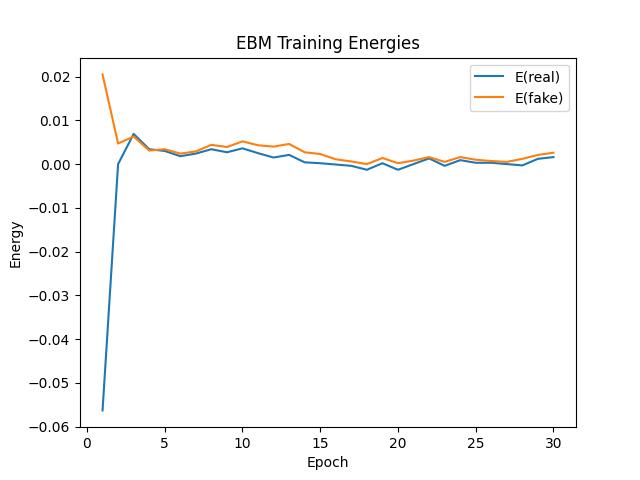
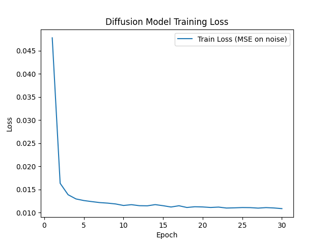

<div align="center">

# CIFAR-10 Generative Models

### An Energy-Based Model and a Diffusion Model you can train, ship, and serve.

An Energy-Based Model (EBM) with Langevin sampling and a DDPM-style UNet diffusion model,
built with **PyTorch**, trained on CIFAR-10 (resized to 64×64), and served as a REST API
with **FastAPI** that streams freshly generated images.


<br/>




</div>

---

CIFAR-10 Generative Models is a small generative-modeling project for Assignment 4. You
train an Energy-Based Model (contrastive divergence + Langevin dynamics) and a Diffusion
Model (DDPM noise prediction with a UNet) on CIFAR-10, save the checkpoints, and then load
them into a FastAPI service that generates brand-new 64×64 RGB images on demand — extending
the Module 6 Class Activity API pattern from Assignment 3.

## Project Structure

```text
assignment4/
├── app/
│   └── main.py              # FastAPI inference server
├── imgmodel/
│   ├── model.py             # EnergyModel + UNet (+ time embeddings)
│   ├── ebm.py               # Replay buffer + Langevin dynamics sampling
│   ├── diffusion.py         # DDPM scheduler (q_sample / p_sample / sample)
│   ├── data_loader.py       # CIFAR-10 DataLoader (64×64, [-1, 1])
│   ├── trainer.py           # train_ebm + train_diffusion loops
│   └── utils.py             # Device, dirs, logging, plotting
├── train_ebm.py             # EBM training entry point
├── train_diffusion.py       # Diffusion training entry point
├── data/                    # CIFAR-10 dataset (auto-downloaded)
├── models/                  # Saved checkpoints (final_ebm.pth, best_diffusion.pth, ...)
├── results/                 # Training logs, curves, and per-epoch EBM samples
├── Dockerfile
└── README.md
```

## Model Architecture

Both models operate on `3 × 64 × 64` images normalized to `[-1, 1]`.

### Energy-Based Model

Maps an image to a single scalar energy. Low energy ≈ realistic image; high energy ≈
unrealistic. No BatchNorm — Langevin sampling perturbs one image at a time, and batch
statistics would leak across samples.

| Stage | Layer | Output |
|-------|-------|--------|
| Down 1 | `Conv2d(3, 64, 3, s=2, p=1)` → SiLU | 64 × 32 × 32 |
| Down 2 | `Conv2d(64, 128, 3, s=2, p=1)` → SiLU | 128 × 16 × 16 |
| Down 3 | `Conv2d(128, 256, 3, s=2, p=1)` → SiLU | 256 × 8 × 8 |
| Down 4 | `Conv2d(256, 256, 3, s=2, p=1)` → SiLU | 256 × 4 × 4 |
| Head | AdaptiveAvgPool → `Linear(256, 128)` → SiLU → `Linear(128, 1)` | 1 scalar |

- **Optimizer:** Adam, `lr = 1e-4`, `betas = (0.0, 0.999)`
- **Loss:** `E(real) − E(fake) + α · (E(real)² + E(fake)²)`, `α = 0.1`
- **Sampling:** Langevin dynamics, 60 steps, step size 10.0, noise scale 0.005
- **Epochs:** 30, **batch size:** 64, persistent replay buffer of size 8192

### Diffusion Model (UNet)

A noise-prediction UNet conditioned on a sinusoidal timestep embedding. Three stride-2
downsampling blocks bring the spatial resolution from 64×64 to an 8×8 bottleneck, then
symmetric upsampling with skip connections reconstructs the predicted noise.

| Stage | Layer | Output |
|-------|-------|--------|
| In | `Conv2d(3, 64, 3, p=1)` | 64 × 64 × 64 |
| Down 1 | ResidualBlock(64→64) → stride-2 Conv | 64 × 32 × 32 |
| Down 2 | ResidualBlock(64→128) → stride-2 Conv | 128 × 16 × 16 |
| Down 3 | ResidualBlock(128→256) → stride-2 Conv | 256 × 8 × 8 |
| Bottleneck | ResidualBlock × 2 | 256 × 8 × 8 |
| Up 3 | ConvTranspose + skip + ResidualBlock | 128 × 16 × 16 |
| Up 2 | ConvTranspose + skip + ResidualBlock | 64 × 32 × 32 |
| Up 1 | ConvTranspose + skip + ResidualBlock | 64 × 64 × 64 |
| Out | GroupNorm → SiLU → `Conv2d(64, 3, 3, p=1)` | 3 × 64 × 64 |

- **Optimizer:** Adam, `lr = 2e-4`
- **Loss:** MSE between predicted noise and true noise (`F.mse_loss`)
- **Schedule:** linear β from `1e-4` to `0.02`, **T = 1000** timesteps
- **Epochs:** 30, **batch size:** 64
- Time embedding: sinusoidal (`max_period = 10000`) → MLP → injected into each ResidualBlock

## Requirements

This project uses **Python 3.12+** and is managed with [`uv`](https://docs.astral.sh/uv/).

Main dependencies:

- PyTorch (`torch`, `torchvision`)
- FastAPI + Uvicorn
- NumPy, Matplotlib

> **Note:** `torch` (2.12.1) and `torchvision` (0.27.1) are already declared in the root
> `pyproject.toml` and pinned in `uv.lock`, so `uv sync` installs the exact versions. The
> Docker image installs the matching **CPU** builds at the same pinned versions, so a build
> never downloads a different torch release.

## How to Run Locally

Run the activation commands from the repository root, then enter `assignment4/` before
training or serving because the code imports the local `imgmodel` package.

### 1. Install dependencies

```bash
# from the repository root
uv sync
```

`uv sync` makes the root `.venv` exactly match `uv.lock`. If you maintain a custom PyTorch
build (for example, a CUDA-specific wheel), install it in the environment yourself and skip
this command. The commands below invoke the environment directly and therefore do not
trigger an automatic uv sync.

### 2. Train the models (optional — checkpoints already included)

Windows PowerShell:

```powershell
.\.venv\Scripts\Activate.ps1
cd assignment4

# Energy-Based Model
python train_ebm.py

# Diffusion Model (UNet)
python train_diffusion.py
```

macOS/Linux:

```bash
source .venv/bin/activate
cd assignment4
python train_ebm.py
python train_diffusion.py
```

This downloads CIFAR-10 to `data/` (if missing) and writes:

- `models/final_ebm.pth`, `models/ebm_sample_buffer.pth` (Langevin replay buffer)
- `models/best_diffusion.pth`, `models/final_diffusion.pth`
- `results/ebm_training_log.csv`, `results/ebm_training_curves.png`
- `results/ebm_samples_epoch_XX.png` (per-epoch sample grids for visual inspection)
- `results/diffusion_training_log.csv`, `results/diffusion_training_curves.png`

### 3. Start the API

```powershell
.\.venv\Scripts\Activate.ps1
cd assignment4
fastapi dev app/main.py
```

Alternatively, if the environment is already complete, `uv run --no-sync fastapi dev
app/main.py` uses uv without modifying installed packages.

Then open the interactive Swagger UI:

```text
http://127.0.0.1:8000/docs
```

> The server loads `models/final_ebm.pth` and `models/best_diffusion.pth` at startup, so
> make sure those files exist. If `models/ebm_sample_buffer.pth` is present, EBM sampling
> starts Langevin chains from replay-buffer samples (matching training); otherwise it
> falls back to pure noise, which needs far more steps to produce anything.

## API Endpoints

### Root

```http
GET /
```

Example response:

```json
{
  "message": "CIFAR-10 Generative Models API is running",
  "device": "cpu",
  "ebm_checkpoint": ".../assignment4/models/final_ebm.pth",
  "diffusion_checkpoint": ".../assignment4/models/best_diffusion.pth"
}
```

### Generate with the Energy-Based Model

```http
GET /generate/ebm
GET /generate/ebm/batch?num_images=16
```

Returns a PNG image (`image/png`). Optional query params: `steps` (default 60) and
`step_size` (default 10.0) for Langevin dynamics. `num_images` accepts values from `1` to
`64`.

```bash
curl "http://127.0.0.1:8000/generate/ebm" --output ebm.png
curl "http://127.0.0.1:8000/generate/ebm/batch?num_images=16" --output ebm_grid.png
```

### Generate with the Diffusion Model

```http
GET /generate/diffusion
GET /generate/diffusion/batch?num_images=16
```

Returns a PNG image (`image/png`) by running the full reverse diffusion loop (1000 steps).
`num_images` accepts values from `1` to `64`.

```bash
curl "http://127.0.0.1:8000/generate/diffusion" --output diffusion.png
curl "http://127.0.0.1:8000/generate/diffusion/batch?num_images=16" --output diffusion_grid.png
```

## How to Run with Docker

The build context is the **repository root** (so `pyproject.toml` and `uv.lock` are
available), while the Dockerfile lives in `assignment4/`.

### 1. Build the image

```bash
# from the repository root
docker build -f assignment4/Dockerfile -t assignment4-gen .
```

### 2. Run the container

```bash
docker run -p 8000:80 assignment4-gen
```

Then open:

```text
http://127.0.0.1:8000/docs
```

## Results

Both models were trained for 30 epochs on CIFAR-10 resized to 64×64, batch size 64. Images
are normalized to `[-1, 1]` and mapped back to `[0, 1]` before serving.

### Energy-Based Model

Adam (`lr = 1e-4`, `betas = (0.0, 0.999)`), persistent contrastive divergence with a replay
buffer. Since CD training loss is not a generation-quality metric, no "best by loss"
checkpoint is kept: the final model is saved to `models/final_ebm.pth`, a sample grid is
written each epoch for visual inspection, and the replay buffer is saved to
`models/ebm_sample_buffer.pth` so the API can initialize Langevin chains from it.

The replay buffer is part of the inference state, not just a training optimization. During
training, negative samples are repeatedly refined across batches. Starting a short
inference chain from saved buffer samples therefore matches training, while starting the
same 60-step chain from fresh noise generally produces noise-like images.

| Epoch | Train Loss | E(real) | E(fake) |
|-------|------------|---------|---------|
| 1 | −0.0453 | −0.0552 | 0.0204 |
| 10 | 0.0000 | 0.0022 | 0.0040 |
| 20 | 0.0012 | 0.0005 | 0.0012 |
| 30 | 0.0014 | 0.0022 | 0.0027 |

These values come from the original run and show that the contrastive gap collapsed after
the first epoch. Fake energy remains slightly above real energy, but the margin is too small
to establish good generation quality. The updated trainer saves per-epoch sample grids
instead of treating the lowest CD loss as the best model; retraining is required to produce
those grids and `models/ebm_sample_buffer.pth`.

<div align="center">


</div>

### Diffusion Model

Adam (`lr = 2e-4`), linear β schedule over T = 1000 steps. The checkpoint with the lowest
noise-prediction MSE is saved to `models/best_diffusion.pth`.

| Epoch | Train Loss (MSE) |
|-------|------------------|
| 1 | 0.047769 |
| 10 | 0.011529 |
| 20 | 0.011208 |
| 30 | 0.010848 |

The noise-prediction loss drops sharply in the first few epochs and then slowly improves,
ending around ~0.011. This is a typical DDPM learning curve on CIFAR-10 at this scale:
early epochs learn coarse structure, later epochs refine high-frequency detail.

<div align="center">


</div>
